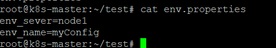

#### Configmap

ConfigMap là một tài nguyên giúp bạn quản lý cấu hình của ứng dụng mà không cần thay đổi mã nguồn. ConfigMap chứa các cặp giá trị key-value, và chúng thường được sử dụng để lưu trữ thông tin như cài đặt, biến môi trường, hoặc các giá trị cấu hình khác mà ứng dụng của bạn có thể cần.

#### Đọc configmap từ 1 file bên ngoài


#### Chạy lệnh tạo configmap bằng imperative

```bash
  kubectl create configmap myconfigmap-1 --from-env-file=env.properties
```
=> configmap đã được tạo configmap/myconfigmap-1 created

#### Kiểm tra lại trên hệ thống

```bash
  kubectl get configmap
```

```bash
  kubectl get configmap <tên configmap> -oyaml 
```